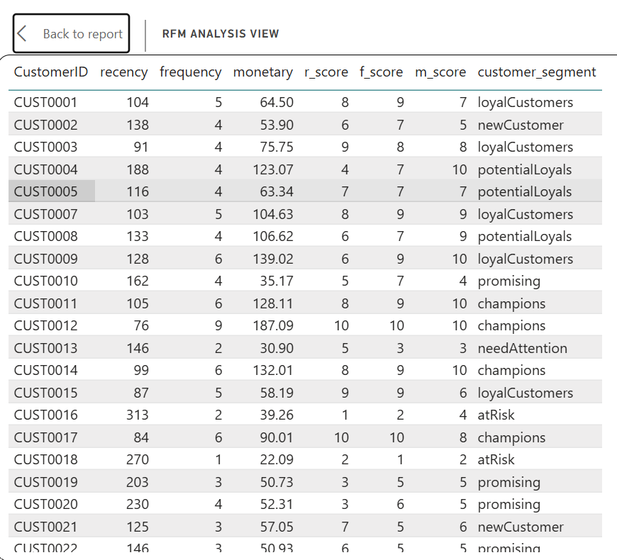
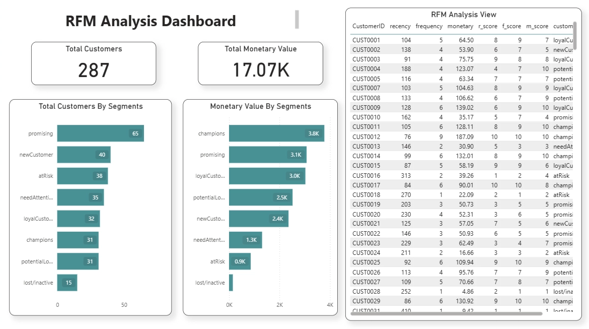

# RFM Customer Segmentation Analysis | BigQuery & Power BI

## Project Overview

RFM is a customer segmentation or marketing technique that is used by business to properly analyze the customers based on their purchases and behavioral patterns.

- **R stands for Recency** - It indicates the most recent purchase a customer made and the gap between the recent purchase and current date. The lesser the days, the more better for the business
- **F stands for Frequency** - It shows how often a customer made a purchase
- **M stands for Monetary** - It tells a business the total amount of money a user spent over a specific period of time

In this project, RFM analysis was performed on a customer retail dataset to segment customers and derive actionable business insights using BigQuery and Power BI.
It ranks customers to identify the most valuable ones, predict future behavior, and boost retention through personalized marketing. 
The customer who bought recently, buys often and spend a lot is considered to be the golden or most valuable customer for a business.

---

## Project Objective

- To segment customers based on purchase behavior and identify high-value, at-risk, and growth opportunity groups
- Assigning ranks to the customers cohorts (10 = best, 01 = worst)
- To identify the valuable customers by segmenting them based on their RFM scores
- The RFM scores are given as follows -

| Segment | RFM Score |
|---|---|
| Champions | 27 – 30 |
| Loyal Customers | 24 – 26 |
| Potential Loyalist | 21 – 23 |
| New Customers | 17 – 20 |
| Promising | 13 – 16 |
| Need Attention | 9 – 12 |
| At Risk | 5 – 8 |
| Inactive/Lost Customers | 1 – 4 |

---

## SQL Queries (BigQuery)
[rfm_analysis.sql](sql/rfm_analysis.sql)

## Visualization Link
[rfm_visualization.pbix](dashboard/rfm_visualization.pbix)

---

## Executive Summary

This analysis was performed using BigQuery for SQL-based data analysis and RFM scoring, and Power BI for visualization. Key findings include champion customers (RFM score 27-30) drive the majority of revenue despite being a small group, Promising customer segment is the largest indicating major upsell potential. There are (~34.5%) users with frequency ≤ 2 and around 11% are one-time buyers.

---

## Key Business Insights

Champions customers, despite being less in number contributes major share of revenue to the business. This also indicates the customer concentration risk that might impact the revenue on even losing 2-3 customers.

Promising customers (RFM score 13-16), forms the largest segment, suggest the biggest growth opportunity. Converting even 20-30% of them to loyal customers will result in the monetary growth.

Around (34.5%) customers have made purchases 2 or less, with (~11%) being the first time buyers, indicating low repeat purchase rate (less frequency).

Monetary fluctuation is seen throughout the year but showed a recovery trend in the latter months, this suggests customer is spending more in the latter half of the year due to seasonality, festival or holidays.

---

## Recommendations

Focusing on improving the retention of champion customers, introducing them to VIP programs or offers to help in retention. Diversifying the customers base by increasing the conversion of loyal customers or potential loyalist into the category of champion customer segment to reduce reliance.

Improve conversion of loyal and promising customers into champions by giving them offers that will help in increasing the champion customer base.

Low frequency scores among customers indicates gap in repeat purchase, lack of repeat business or loyalty. Focus on improving the brand trust among users by targeted marketing campaigns or providing them offers to increase their frequency (repeat purchase).

Due to high monetary values in the latter half of the year, indicates business that stronger revenue potential in the latter half of the year.

---

## Assumptions and Caveats

- Assuming the increase in monetary value in the latter half of the year is due to seasonality, festive season or holidays
- Recency is calculated as the gap between a customer's last purchase date and the reference date of 17th March 2025
- The dataset is assumed to be complete with no missing transactions for the year (2025)
- Dataset is small with only 287 customers, no duplicates, no demographic data is available

---

## Dataset Used

- **Source**: Tutorial dataset by [Mo Chen]
- **Note**: Dataset is sourced from the tutorial for learning purposes. Insights and dashboard are my own.
